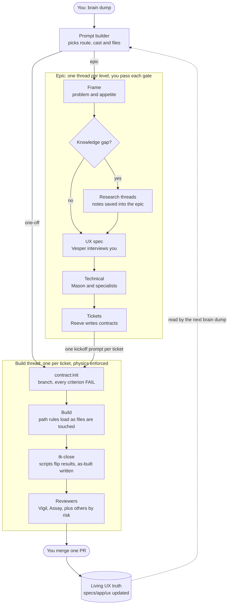

# How work moves

> **The whole thing in one breath.** You brain dump. The prompt builder turns it into a proper prompt with the right role and the right files. From then on, every stage runs in its own thread and ends at a gate you pass. Agents do the work, scripts decide when it is done, and the app's living UX spec always says how the app works now.

## The game you're playing

Think of the repo as a game world with five systems.

| System | Lives in | What it holds | Who changes it |
|---|---|---|---|
| **Library** | `docs/` | Everything we know: canon, references, conventions, templates, these workflows | Humans, through threads. Agents read it. |
| **Party** | `docs/roles/` | The cast: Vesper (UX), Mason (CTO), Reeve (tickets), Vigil (QA), Assay (UI critic) and more | You pick who plays each level |
| **Quest board** | `specs/` | The app's living UX truth, plus every epic and ticket with its records | Agents write; scripts check |
| **World** | `apps/`, `packages/` | The code | Agents, in build threads |
| **Physics** | `.claude/`, `tooling/`, `toolkit.json` | Settings, hooks, checks, path rules | Fixed. Nobody negotiates with physics. |

The idea behind the Physics: a rule written in markdown is a request, and a rule enforced by a check is a law. Wherever a rule can be checked, the toolkit checks it. An agent can't push, can't mark its own work done, and can't start a ticket on an unapproved spec. It is not trusted not to; it simply can't.

## Two ways to play

| | One-off: a side quest | Epic: a campaign |
|---|---|---|
| **What** | One ticket that changes something that already exists | A feature, an area of the app, or a whole app |
| **Threads** | Two: the builder, then the build | One per level, plus one per ticket |
| **You judge** | The merge | Every gate and every merge |
| **Guide** | [`one-off.md`](one-off.md) | [`epic.md`](epic.md) |

**The routing rule.** The prompt builder applies it, and you can too. It's an epic if any of these is true:
- the work needs more than one ticket
- it adds a new surface (a screen, a flow, a component users meet)
- no living UX file covers what is changing
- the problem itself isn't settled yet

Otherwise it's a one-off.

## The map



This map renders as a diagram on GitHub. The docs app shows it as text until Mermaid rendering is added, which is a held item.

## Where everything lives

```
specs/
├─ _status.md                       generated: every item's state
└─ web/                             one folder per app (web, mobile, marketing...)
   ├─ ux/                           LIVING TRUTH: how the app works now
   │  ├─ _global/                   architecture, navigation, shell, app-wide decisions
   │  └─ onboarding/                one folder per area of the app
   │     ├─ overview.md
   │     └─ welcome.md              one file per surface
   ├─ epics/
   │  └─ OB2-onboarding-v2/         a campaign
   │     ├─ brief.md                problem, appetite, knowledge gaps
   │     ├─ research/               optional side missions
   │     ├─ prompts/                every prompt this epic ran, numbered
   │     ├─ ux/                     proposed changes, mirroring ux/ paths
   │     ├─ technical.md
   │     └─ tickets/OB2-3-welcome-copy/
   │        └─ contract.md, results.json, as-built.md
   └─ one-offs/
      └─ WEB-41-fix-filter/         a side quest: same three files
```

Work that spans apps (sign-in shared by web and mobile, for example) lives in `specs/_shared/` with the same shape.

## The three laws

1. **A rule in a check is a law.** If the toolkit can check it, it does, and a failure message tells the agent exactly what to do instead.
2. **The builder never grades itself.** Every criterion starts at FAIL, only scripts flip it, and reviewers work in a fresh context without the builder's summary.
3. **One fact, one home.** How the app works lives in `specs/<app>/ux/`. What an epic proposes lives in its folder until it ships. Status is generated, never hand-kept.

## Truth and records

`specs/` holds two kinds of files. Knowing which is which is most of the mental model.

- **Truth** (`specs/<app>/ux/`). This always says how the app works now. It changes in two ways: an epic ships and its proposals are promoted, or a one-off edits a truth file in the same PR as the code.
- **Records** (epic and ticket folders). What we intended, what we built, and how we proved it. Records freeze once done.

So "onboarding version two" is a new epic. Its `ux/` folder proposes changes to the onboarding truth files, and when its tickets ship, those proposals become the truth. Version one stays readable in git history and in the earlier epic's folder.

## Your HUD

What you see while you play:

| When | What appears |
|---|---|
| Opening a session | One short status line: active items and what's next |
| An agent tries something forbidden | A denial that names the right move ("use yarn", "only Taylor pushes") |
| A session that changed files stops | A quick verify, then "Left to go" for the active ticket |
| Anytime | `yarn status` (everything) or `yarn status --epic OB2` (one campaign, in build order) |

## Explain it back (30 seconds)

> "Every piece of work starts as a brain dump into the prompt builder, which decides whether it's a one-off or an epic and writes the first prompt. Epics go through levels (frame, optional research, UX, technical, tickets), each in its own thread with the right role and a gate I pass. Every ticket then gets its own build thread. It starts with all its checks failing, and only scripts can mark them passed. Reviewers chosen by risk check it with fresh eyes, I merge, and the living UX spec updates so it always describes the real app."

## Go deeper

- [`glossary.md`](glossary.md): every term in one line, plus old words mapped to new ones.
- [`one-off.md`](one-off.md): the side quest, step by step.
- [`epic.md`](epic.md): the campaign, level by level.
- `prompt-builder.md` and `stages/`: what the agents follow (written in J14).
